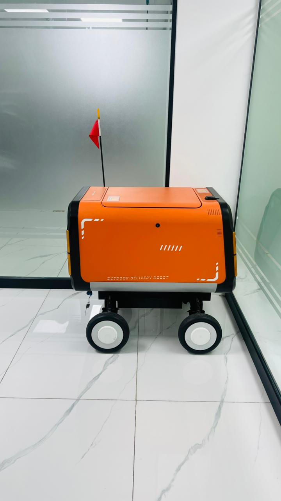

# ONEPATH

**Your path to intelligent robotics.**

<p align="center">
<a href="https://arxiv.org/abs/2412.18588">Technical Paper</a> |
<a href="https://onepath.io/">Website</a> |
<a href="https://onepath.io/">Documentation</a> |
<a href="https://github.com/ONEPATH-ROBOTICS/ONEPATH">GitHub</a> |
<a href="https://x.com/onepathrobotics">X</a> |
<a href="https://discord.gg/onepath">Discord</a>
</p>

## Project Overview

ONEPATH is a modular AI runtime that empowers developers to create and deploy multimodal AI agents across digital environments and physical robots.

## Key Features

* **Modular AI Runtime** - Flexible and extensible architecture
* **Multimodal AI Agents** - Process diverse inputs and perform various actions
* **Configuration Files (JSON5)** - Easy agent configuration
* **LLMs/VLMs** - Support for multiple Large Language Models and Vision Language Models
* **Hardware Abstraction Layer (HAL)** - Seamless hardware integration
* **WebSim** - Web-based debugging and visualization tool

## Getting Started

### Clone the Repository

```bash
git clone https://github.com/ONEPATH-ROBOTICS/ONEPATH.git
cd ONEPATH
```

### Install Dependencies

```bash
uv sync
```

### Obtain an API Key

Get your API key from the [ONEPATH Portal](https://onepath.io/).

### Launch ONEPATH

```bash
uv run python src/run.py
```

Or using Docker:

```bash
docker compose up
```

For more help connecting ONEPATH to your robot hardware, visit [onepath.io](https://onepath.io/).

## Documentation

More detailed documentation can be accessed at [ONEPATH](https://onepath.io/).

Try out some [examples](https://onepath.io/).

## Source Code

The source code and examples are available on [GitHub](https://github.com/ONEPATH-ROBOTICS/ONEPATH).

## Contributing

Please make sure to read the [Contributing Guide](./CONTRIBUTING.md) before making a pull request.

## License

This project is licensed under the terms of the MIT License.
